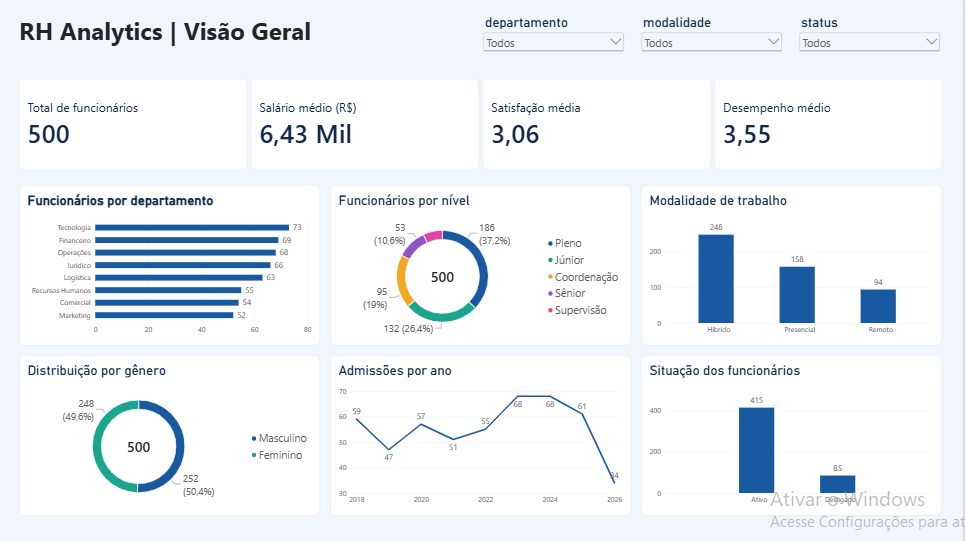

# RH Analytics | Visão geral dos funcionários

Projeto de análise de dados de Recursos Humanos desenvolvido por **Guilho Santos**, com tratamento em **Python no Google Colab**, organização da camada analítica em **PostgreSQL** e visualização no **Power BI**.

O objetivo é oferecer uma visão geral dos funcionários, reunindo perfil, estrutura organizacional, remuneração, satisfação e desempenho em um dashboard interativo. Os dados são **fictícios**, usados para estudo e portfólio.



## Fluxo do projeto

1. **Dados originais:** arquivo Excel com as abas Funcionarios, Departamentos e Niveis.
2. **Data Cleaning:** padronização de datas, recálculo de idade e tempo de empresa e ajuste dos registros de gênero na base simulada.
3. **PostgreSQL:** importação dos dados tratados e criação de quatro VIEWs temáticas.
4. **Power BI:** importação das VIEWs e construção da página Visão Geral, com filtros de departamento, modalidade e status.

## Principais resultados

Os indicadores abaixo foram recalculados a partir do CSV tratado, considerando **todos os registros**, sem filtros.

| Indicador | Resultado |
|---|---:|
| Funcionários cadastrados | 500 |
| Funcionários ativos | 415 (83%) |
| Funcionários desligados | 85 (17%) |
| Salário médio de todos os registros | R$ 6.434,50 |
| Satisfação média | 3,06 |
| Desempenho médio | 3,55 |
| Idade média | 39,43 anos |
| Tempo médio de empresa registrado | 3,98 anos |

- **Tecnologia** concentra o maior número de registros: 73 (14,6%), e o maior salário médio departamental: R$ 8.588,49.
- A modalidade **híbrida** predomina com 248 registros (49,6%), seguida de presencial, com 158 (31,6%), e remoto, com 94 (18,8%).
- Os níveis **Pleno e Júnior** somam 318 registros (63,6% da base).
- A distribuição de gênero da base tratada é de 252 registros masculinos (50,4%) e 248 femininos (49,6%).
- **2023 e 2024** registram o maior número de admissões, com 68 cada. O valor de 2026 representa um ano parcial e não permite concluir uma queda anual.

**Interpretação:** os 17% representam a proporção de registros com status Desligado; não constituem uma taxa de turnover por período. Médias gerais incluem ativos e desligados. Consulte [resultados e limitações](docs/resultados.md).

## Qualidade e tratamento dos dados

A comparação entre os arquivos recebidos, alinhada por ID_Funcionario, identificou:

| Campo alterado | Registros com diferença |
|---|---:|
| Idade | 11 |
| Genero | 267 |
| Tempo_Empresa_Anos | 500 |

A base tratada possui 500 IDs únicos, nenhuma linha duplicada e nenhuma ocorrência de desligamento anterior à admissão. Os campos de desligamento estão vazios para os 415 funcionários ativos.

O notebook registra **25/09/2026** como data de referência da limpeza. A reprodução preparada mantém essa data para evitar que os resultados mudem a cada execução. A associação de gênero ao primeiro nome foi uma regra do exercício com dados fictícios; em bases reais, esse atributo deve vir de informação declarada ou de uma fonte validada.

Veja [metodologia](docs/metodologia.md) e [dicionário de dados](docs/dicionario-dados.md).

## Camada analítica no PostgreSQL

| VIEW | Finalidade |
|---|---|
| vw_rh_funcionarios | Visão geral do cadastro |
| vw_rh_turnover | Registros com status Desligado |
| vw_rh_performance | Desempenho, satisfação e treinamento |
| vw_rh_remuneracao | Salários e variação salarial absoluta e percentual |

As quatro VIEWs fornecidas estão em [sql/03_views.sql](sql/03_views.sql). A página Visão Geral utiliza campos de vw_rh_funcionarios, conforme a definição do relatório no PBIX. O nome vw_rh_turnover identifica uma seleção de desligados, sem calcular por si só o indicador de turnover.

## Organização do repositório

| Pasta | Conteúdo |
|---|---|
| dados/originais | Excel recebido, preservado |
| dados/tratados | CSV utilizado na análise |
| notebooks | Notebook original e versão organizada para reproduzir a limpeza |
| sql | Tabela, importação, VIEWs e consultas de validação |
| dashboard | Arquivo PBIX e imagem do relatório |
| docs | Metodologia, resultados, dicionário e guia de publicação |
| scripts | Script para recalcular indicadores e comparar as bases |

## Como reproduzir

### 1. Python / Google Colab

Abra [notebooks/01_limpeza_rh.ipynb](notebooks/01_limpeza_rh.ipynb) no Colab e execute as células em ordem. Envie o Excel de dados originais quando solicitado. A execução exporta um CSV separado por ponto e vírgula, em UTF-8, na ordem original das colunas.

O [notebook original](notebooks/Portfolio_RH_original.ipynb) foi preservado como evidência da etapa realizada. A versão organizada contém somente a rotina principal, com data fixa e exportação CSV. Não altera o CSV entregue pelo autor.

Para recalcular os indicadores localmente, na raiz do projeto:

```bash
python -m pip install -r requirements.txt
python scripts/analisar_rh.py
```

### 2. PostgreSQL

Em um banco de estudo, execute `sql/01_tabela.sql`. Importe o CSV tratado para `public.rh_funcionarios` conforme `sql/02_importacao.sql`. Em seguida execute `sql/03_views.sql` e `sql/04_validacao.sql`.

O CSV usa `;`, decimais com ponto, cabeçalho e campos vazios para NULL. Os nomes SQL sem aspas são normalizados para minúsculas pelo PostgreSQL. A tabela segue a ordem das 29 colunas do CSV.

### 3. Power BI

Abra `dashboard/RH.pbix` no Power BI Desktop. Ajuste a conexão PostgreSQL para seu servidor e banco nas configurações da fonte de dados, informe suas credenciais e atualize. Os valores exibidos dependem dos filtros selecionados.

O PBIX contém uma página chamada **Visão Geral**. Nenhum link público do relatório foi fornecido; a imagem acima permite consultar o resultado no próprio repositório.

## Ferramentas e competências demonstradas

- Python, pandas e NumPy: preparação e conferência de dados.
- Google Colab: notebook de tratamento.
- PostgreSQL e SQL: VIEWs, filtros e cálculos de remuneração.
- Power BI: agregações, visualizações e filtros interativos.
- Documentação: rastreabilidade do fluxo e explicação dos indicadores.

## Autor

**Guilho Santos** — [GitHub](https://github.com/GU1LHO)

Projeto de portfólio com dados fictícios. As conclusões descrevem esta base simulada e não uma organização real.
